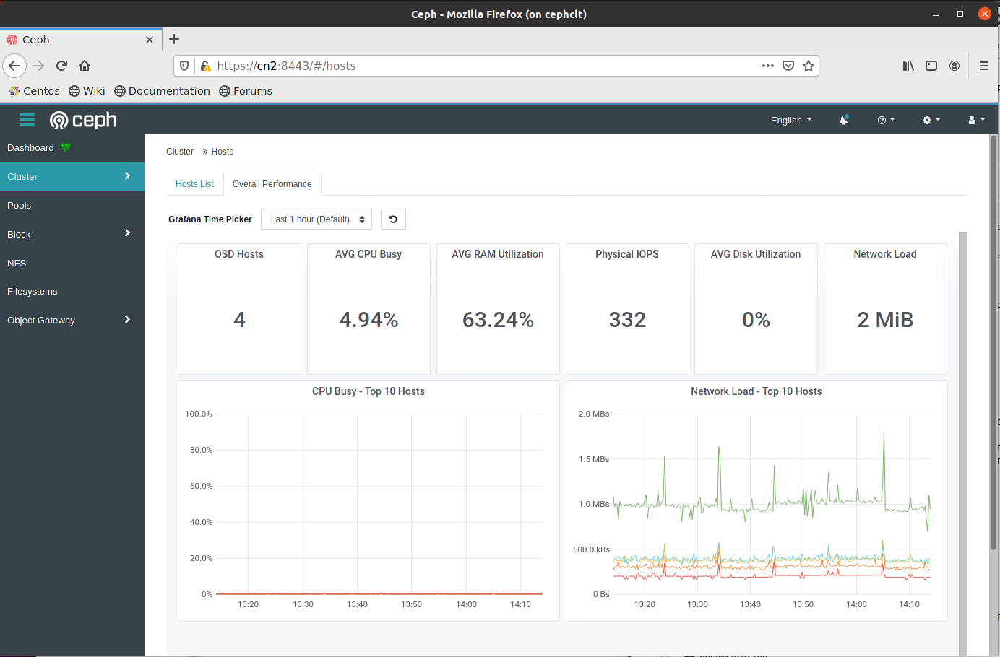

# Ceph Dashboard
Ceph Dashboard, fourni à partir de la version Luminous, est d'abord une simple vue des diverses informations d’un cluster Ceph via une interface Web.
Cette interface est un module intégré au service mgr de Ceph.
A partir de la version Octopus, le dashboard permet de gérer l'ensemble des fonctions d'un cluster Ceph.

## Accès au dashboard
Comme tous les services dans Ceph, le dashboard est en mode haute disponibilité. Voici une méthode pour connaître l'url de connexion par défaut :
```
[ceph: root@cn1 /]# ceph mgr services
{
    "dashboard": "https://cn2:8443/",
    "prometheus": "http://cn2:9283/"
}
```
Via la commande ```ceph mgr services```, il est possible de récupérer l'url du dashboard. 
## outils de métrologie
Grafana et Prometheus peuvent être installés à l'aide de cephadm. Ils seront automatiquement configurés par cephadm. Vous retrouverez ensuite l'ensemble des métriques depuis le dashboard sans effort. Lorsque vous créez un cluster Ceph avec cephadmin et en activant la gestion des containers, Grafana et Prometheus sont installés et configurés par défaut et sont donc directement accessibles ;)
## Acces au Dashboard depuis ce labs
Le Dashboard utilise les noms des hosts du labs, qui ne sont pas définit à l'extérieur du labs. Pour facilité sont acces, vous aller utiliser firefox depuis une session distante depuis la vm cephclt.
```
sg4r@work:~/dev/ceph-octopus$ vagrant ssh cephclt
Last login: Thu Jan 21 08:06:58 2021 from 192.168.121.1
/usr/bin/xauth:  file /home/vagrant/.Xauthority does not exist
[vagrant@cephclt ~]$ 
# vérifier avec xeyes que le déport d'affichage d'X fonctionne
[vagrant@cephclt ~]$ xeyes 
Warning: locale not supported by C library, locale unchanged
[vagrant@cephclt ~]$ 
# install de firefox car il n'est pas inclut par défaut dans l'image
[vagrant@cephclt ~]$ sudo dnf install -y  firefox
# utiliser firefox depuis cephclt
[vagrant@cephclt ~]$ firefox https://cn1:8443/ &
[1] 3625
```
Vous allez être redirigé vers la page d'authentification du Dashboard. Utilisez le compte admin et votre mot de passe défini lors de la création du cluster.
Ouvrez un nouvel onglet et saisir l'url ```https://cn1:3000``` pour valider l'enregistrement du certificat autosigné. Après la visualisation des métriques sous Grafana, vous pouvez clôturer l'onglet de Grafana.
A présent depuis le Dashboard Ceph, allez dans "Cluster", puis "Host", puis "Overall Performance" pour visualiser directement les métriques prédéfinis.


## Documentation
Pour plus d’information voir https://docs.ceph.com/en/latest/mgr/dashboard/
