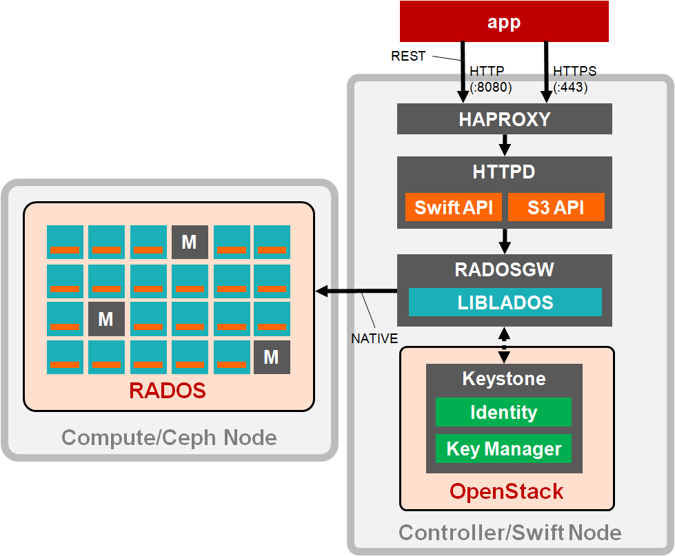

# Stockage S3 / Swift
Ceph Rados Gateway est une interface de stockage d'objets construite sur la librados pour fournir aux applications une passerelle RESTful vers les clusters de stockage Ceph.
Ceph Rados Gateway prend en charge deux interfaces:
 - S3: fournit un stockage compatible avec l'API RESTful Amazon S3.
 - Swift: fournit un stockage compatible avec l'API OpenStack Swift.
## Topologie réseau
La passerelle est accessible depuis l’internet, donc installer RadosGW sur un serveur dédié dans votre DMZ. Il est
possible de répartir la charge avec un HAPROXY. Les flux librados seront autorisé vers le réseau publique votre cluster Ceph.

source https://qiita.com/jundo414/items/7ac3bdf3967ec67d7680

## Installation de RadosGW
Le service RadosGW s’installe généralement sur un nœud dédié. Prévoir un CPU à 8 coeurs et entre 32Go à 64Go de
RAM en fonction du nombre de clients. Pour équilibrer la charge, il est conseillé d’utiliser plusieurs RadosGW avec un
proxyHA et comptez une RadosGW pour 50-100 OSDs .
```
# a completer
```
## Documentation
Pour plus d’information voir https://docs.ceph.com/en/latest/radosgw/
